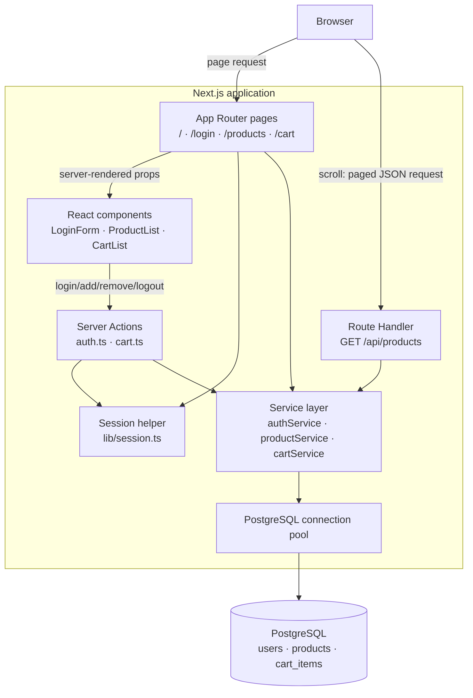
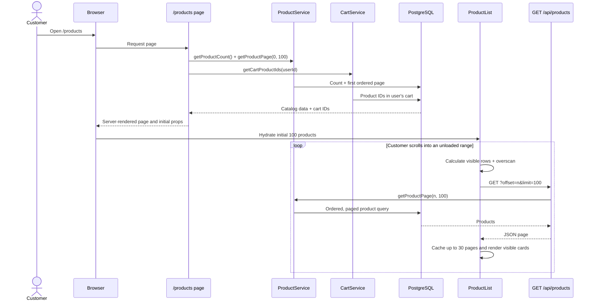

# Application architecture

This application is a Next.js App Router storefront. Pages fetch initial data on the server, interactive controls run in Client Components, and the service layer is the only layer that accesses PostgreSQL.



## Product catalog sequence

The initial page has a small server-rendered payload. ProductList virtualizes the UI, retaining only visible cards and a bounded client page cache. As the customer scrolls, it requests the required 100-product page from the route handler.



## Cart mutation sequence

Cart membership is stored in `cart_items` as a user/product relationship. The page uses that relationship to initially mark cards as `Added`; the client updates its local membership set after each successful action.

```mermaid
sequenceDiagram
  actor Customer
  participant ProductCard
  participant CartAction as Server Action
  participant Session
  participant CartService
  participant Database as PostgreSQL

  Customer->>ProductCard: Click Add to Cart
  ProductCard->>CartAction: addToCart(productId)
  CartAction->>Session: getSession()
  Session-->>CartAction: Authenticated user ID
  CartAction->>CartService: addItemToCart(userId, productId)
  CartService->>Database: INSERT cart_items (on conflict do nothing)
  Database-->>ProductCard: Success
  ProductCard->>ProductCard: Mark product as Added; show Remove

  Customer->>ProductCard: Click Remove
  ProductCard->>CartAction: removeFromCart(productId)
  CartAction->>Session: getSession()
  CartAction->>CartService: removeItemFromCart(userId, productId)
  CartService->>Database: DELETE matching cart item
  Database-->>ProductCard: Success
  ProductCard->>ProductCard: Remove local cart membership; restore Add
```

## Responsibility boundaries

| Layer | Responsibility |
| --- | --- |
| `app/` pages | Route composition and initial server-side data fetching. |
| `components/` | Interactive UI, viewport virtualization, and display state. |
| `app/actions/` | Authenticated mutations callable from Client Components. |
| `app/api/products/route.ts` | Read-only JSON endpoint for product pages requested during scrolling. |
| `services/` | Database queries and business-data access. |
| `lib/session.ts` | Reading and validating the current user session. |
| `db/pool.ts` | Shared PostgreSQL connection pool. |
