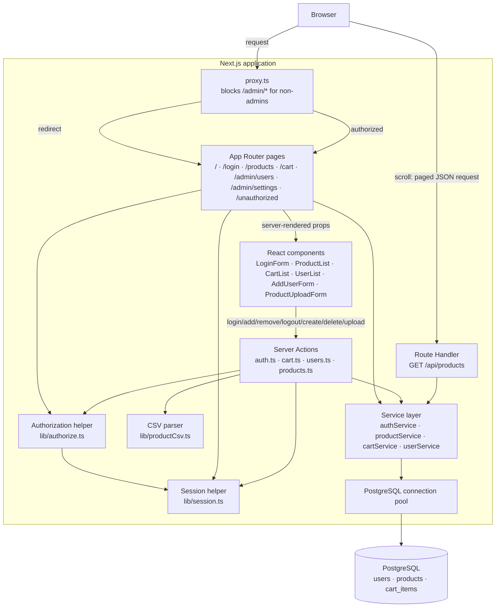
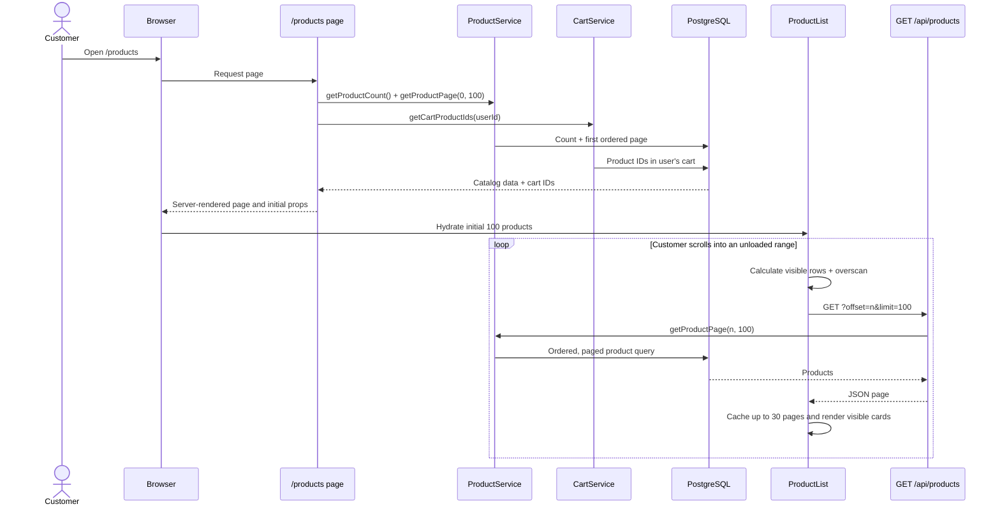
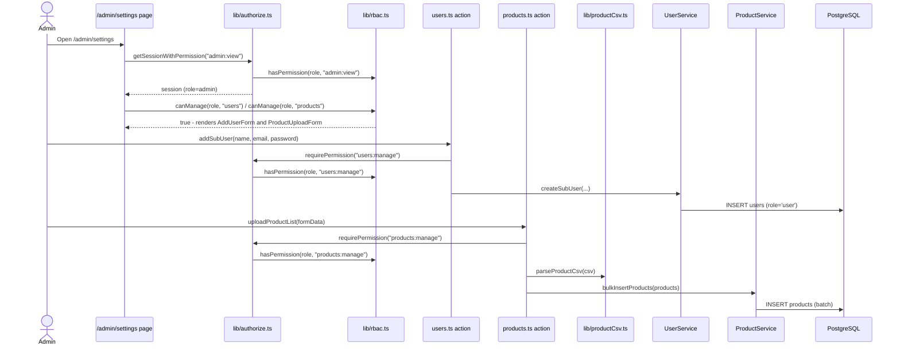

# Application architecture

This application is a Next.js App Router storefront. Pages fetch initial data on the server, interactive controls run in Client Components, and the service layer is the only layer that accesses PostgreSQL. Admin-only routes are additionally gated by a `proxy.ts` (Next.js middleware) file before any page code runs.



## Product catalog sequence

The initial page has a small server-rendered payload. ProductList virtualizes the UI, retaining only visible cards and a bounded client page cache. As the customer scrolls, it requests the required 100-product page from the route handler.



## Cart mutation sequence

Cart membership is stored in `cart_items` as a user/product relationship. The page uses that relationship to initially mark cards as `Added`; the client updates its local membership set after each successful action.

```mermaid
sequenceDiagram
  actor Customer
  participant ProductCard
  participant CartAction as Server Action
  participant Session
  participant CartService
  participant Database as PostgreSQL

  Customer->>ProductCard: Click Add to Cart
  ProductCard->>CartAction: addToCart(productId)
  CartAction->>Session: getSession()
  Session-->>CartAction: Authenticated user ID
  CartAction->>CartService: addItemToCart(userId, productId)
  CartService->>Database: INSERT cart_items (on conflict do nothing)
  Database-->>ProductCard: Success
  ProductCard->>ProductCard: Mark product as Added; show Remove

  Customer->>ProductCard: Click Remove
  ProductCard->>CartAction: removeFromCart(productId)
  CartAction->>Session: getSession()
  CartAction->>CartService: removeItemFromCart(userId, productId)
  CartService->>Database: DELETE matching cart item
  Database-->>ProductCard: Success
  ProductCard->>ProductCard: Remove local cart membership; restore Add
```

## Role-based access control (RBAC)

`role` (`admin` | `user`) lives on the `users` table and is embedded in the session JWT at login. Authorization is **permission-based**, not a scattered `role === "admin"` check. Permissions are `${Resource}:${Action}` pairs (`Resource` = `admin` | `users` | `products`, `Action` = `view` | `manage`), so view access and write access are granted independently per resource - a future role can see the user list without being able to create/delete users, for example. `lib/rbac.ts` is the single registry: `ROLE_PERMISSIONS` maps roles to the permissions they hold, and `PROTECTED_ROUTES` maps route prefixes to the *view* permission required to reach them. Every other layer asks "does this role have this permission?" via `hasPermission`/`canView`/`canManage` instead of hardcoding a role name, so adding a new role, resource, or protected route means editing `lib/rbac.ts` only - no if/else spreads to other files.

- `proxy.ts` — Next.js middleware; looks up the *view* permission required for the request path via `getRequiredPermission()` and redirects unauthenticated requests to `/login` or under-permissioned requests to `/unauthorized`, before any page or action code runs. Unlisted paths pass through untouched, so pages can mix roles (e.g. `/products` is open to any authenticated user, while the "Admin" link only renders for `admin:view`).
- `lib/authorize.ts` — defense-in-depth for server code, built on `lib/rbac.ts`: `getSessionWithPermission(permission)` (used by permission-gated pages, returns `null` instead of throwing so the page can render `<Unauthorized />`) and `requirePermission(permission)` (used by server actions, throws `UnauthorizedError`).

Route visibility and mutation rights are independent checks, which is what makes both of these scale cleanly:

- **Same page, different allowed actions**: a page is either fully route-gated (via `proxy.ts` + `PROTECTED_ROUTES`, checked against a `:view` permission) or open to all authenticated users with individual mutations independently permission-checked in their server action against a `:manage` permission (e.g. `/products` is open to everyone, but only `products:manage` callers can reach `uploadProductList`).
- **Same route, view-only vs. write access**: `/admin/users` and `/admin/settings` are gated on `admin:view` alone, so any role granted that permission can *see* the page and the user list. Whether the "Add user" form and "Delete" buttons render is a *separate* check (`canManage(role, "users")`), computed once per page and threaded down as a prop (e.g. `<UserList canManage={...} />`) - a view-only role sees the same page with those controls simply absent, while the server action still enforces `users:manage` independently as defense-in-depth even if a view-only caller tried to invoke it directly.



Admin accounts can never be deleted: `userService.deleteUser` scopes its `DELETE` to `WHERE role <> 'admin'`, so the constraint holds even if a caller bypasses the UI.

## Responsibility boundaries

| Layer | Responsibility |
| --- | --- |
| `proxy.ts` | Route-level authorization gate, driven by `lib/rbac.ts`'s `PROTECTED_ROUTES` (redirects before rendering). |
| `app/` pages | Route composition and initial server-side data fetching. |
| `components/` | Interactive UI, viewport virtualization, and display state. |
| `app/actions/` | Authenticated/authorized mutations callable from Client Components. |
| `app/api/products/route.ts` | Read-only JSON endpoint for product pages requested during scrolling. |
| `services/` | Database queries and business-data access. |
| `lib/session.ts` | Reading and validating the current user session (includes `role`). |
| `lib/rbac.ts` | Single source of truth for roles, permissions, and protected route prefixes. |
| `lib/authorize.ts` | Permission-based authorization checks for pages and actions, built on `lib/rbac.ts`. |
| `lib/productCsv.ts` | Pure CSV-to-product parsing, independent of persistence or auth. |
| `db/pool.ts` | Shared PostgreSQL connection pool. |
| `db/init.sql` | Schema + seed data, auto-run by Postgres on first (empty-volume) startup. |
